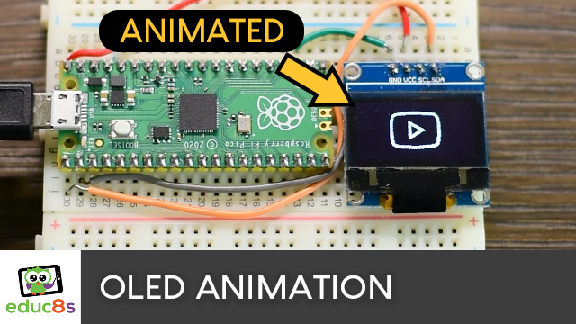

# CircuitPython OLED Display SSD1306 Animated GIF icons
 Display an animated gif on an OLED display.

  

🎥 [Watch the video on YouTube](https://youtu.be/WqyBWcjs_oY)

# Parts Needed

🛒 Monochrome OLED: http://educ8s.tv/part/OLED096
🛒 Color OLED: http://educ8s.tv/part/ColorOLED
🛒  Raspberry Pi Pico: http://educ8s.tv/part/RaspberryPiPico
